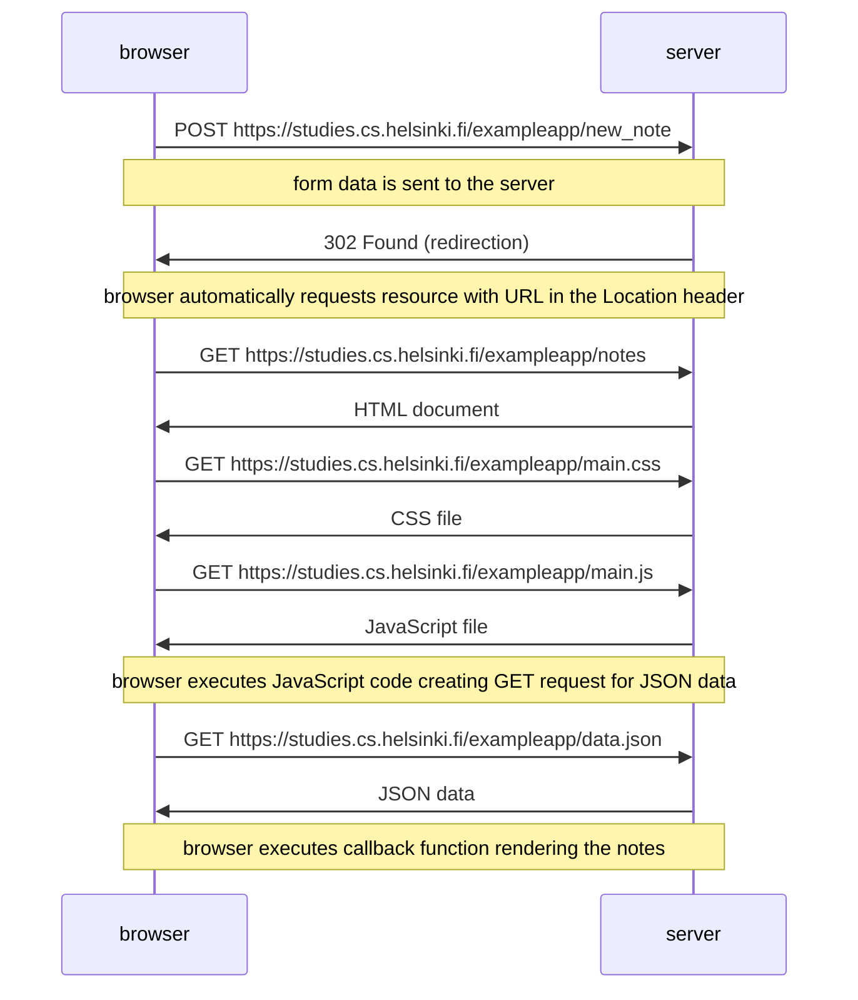

```mermaid

sequenceDiagram
    participant browser
    participant server

    browser->>server: POST https://studies.cs.helsinki.fi/exampleapp/new_note

    Note over browser, server: form data is sent to the server

    server->>browser: 302 Found (redirection)

    Note over browser, server: browser automatically requests resource with URL in the Location header

    browser->>server: GET https://studies.cs.helsinki.fi/exampleapp/notes
    server->>browser: HTML document
    browser->>server: GET https://studies.cs.helsinki.fi/exampleapp/main.css
    server->>browser: CSS file
    browser->>server: GET https://studies.cs.helsinki.fi/exampleapp/main.js
    server->>browser: JavaScript file

    Note over browser, server: browser executes JavaScript code creating GET request for JSON data

    browser->>server: GET https://studies.cs.helsinki.fi/exampleapp/data.json
    server->>browser: JSON data

    Note over browser, server: browser executes callback function rendering the notes
```
