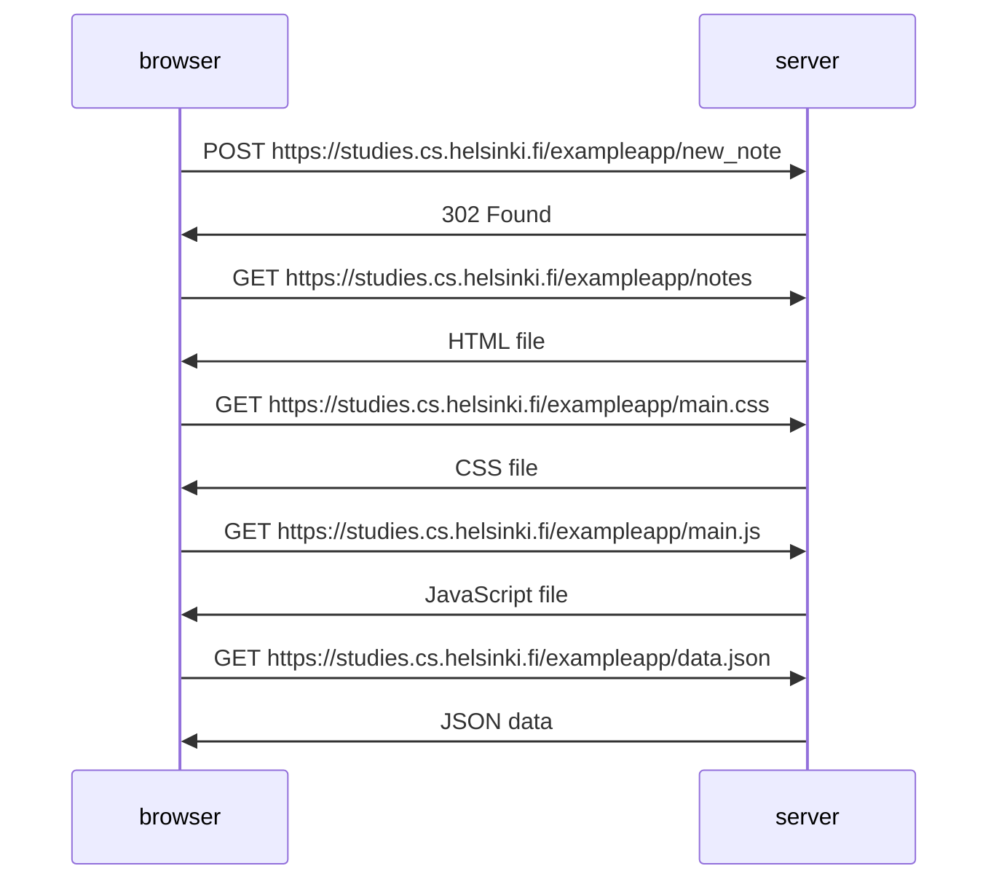

```mermaid

sequenceDiagram
    participant browser
    participant server

    browser->>server: POST https://studies.cs.helsinki.fi/exampleapp/new_note
    server->>browser: 302 Found
    browser->>server: GET https://studies.cs.helsinki.fi/exampleapp/notes
    server->>browser: HTML file
    browser->>server: GET https://studies.cs.helsinki.fi/exampleapp/main.css
    server->>browser: CSS file
    browser->>server: GET https://studies.cs.helsinki.fi/exampleapp/main.js
    server->>browser: JavaScript file
    browser->>server: GET https://studies.cs.helsinki.fi/exampleapp/data.json
    server->>browser: JSON data
```